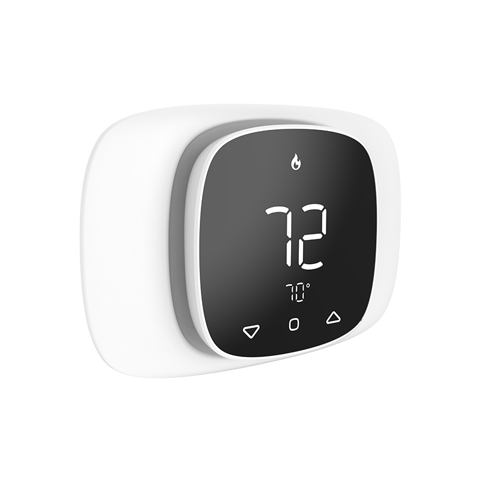

# OWON WiFi HVAC Thermostats

OWON Technology develops and manufactures WiFi smart thermostats for North American 24VAC HVAC systems, including conventional heating and cooling equipment, multi-stage heat pumps, dual fuel systems, and hybrid heating applications.

Founded in 1993, OWON is an ISO 9001:2015 certified OEM/ODM manufacturer specializing in smart energy management, HVAC control, Zigbee devices, and IoT system integration.

## Smart Thermostat Products

### OWON PCT5231 WiFi Thermostat

The PCT5231 is designed for residential, apartment, and light commercial HVAC applications. It supports conventional systems and advanced heat pump configurations, including dual fuel and hybrid heat control.

Key features include:

- Supports up to 2H/2C conventional HVAC systems
- Supports up to 4H/2C heat pump systems
- Dual fuel and hybrid heat switching
- Up to 10 wireless remote room sensors
- 7-day temperature, fan, and sensor scheduling
- Daily, weekly, and monthly energy usage reports
- Mobile app remote control
- Adjustable temperature swing
- Equipment maintenance reminders
- Optional C-wire adapter

Learn more:

[OWON PCT5231 WiFi Thermostat](https://www.owon-smart.com/tuya-wifi-24vac-thermostat-touch-buttonwhite-caseblack-screen-pct-523-w-ty-product/)

### OWON PCT533 Smart HVAC Thermostat

The PCT533 is a premium WiFi thermostat designed for advanced residential and light commercial HVAC control.

Key features include:

- 4.3-inch full-color touchscreen
- Supports 2H/2C conventional and 4H/2C heat pump systems
- Dual fuel and hybrid heat control
- Built-in occupancy sensing
- Indoor humidity monitoring
- Humidifier and dehumidifier control
- Wireless room sensor support
- Energy usage tracking
- Smart scheduling and remote management
- Device-level API support for system integration

Learn more:

[OWON PCT533 Smart HVAC Thermostat](https://www.owon-smart.com/full-color-smart-wifi-thermostat-24vac-owon-manufacturer-product/)

## HVAC Applications

OWON thermostats are suitable for:

- Heat pump and dual fuel HVAC systems
- Residential HVAC upgrades
- Multifamily apartments
- Hotels and hospitality projects
- Light commercial buildings
- Property management systems
- Smart building platforms
- HVAC equipment manufacturers
- OEM and private-label thermostat projects

## OEM and ODM Services

OWON works with HVAC manufacturers, system integrators, distributors, property technology companies, and smart building solution providers.

Available services include:

- Custom thermostat hardware
- Firmware customization
- HVAC control logic development
- WiFi module integration
- Mobile app and cloud integration
- Device-level API support
- Private labeling and packaging
- Scalable manufacturing

- ## Product Documentation

### PCT5231 WiFi Thermostat

The latest technical documentation for the OWON PCT5231 is available below.

- [PCT5231 WiFi Thermostat Datasheet](https://github.com/owontech/owon-hvac-thermostats/blob/main/PCT5231-WiFi-Thermostat-Datasheet.pdf)

## Technical Resources

This repository will be used to share selected technical information, product documentation, integration guidance, and updates related to OWON HVAC thermostat solutions.

## Official Website

Visit the official OWON website:

[OWON Smart HVAC and IoT Solutions](https://www.owon-smart.com/)

## Contact

For OEM, ODM, distribution, or system integration enquiries:

- Email: sales@owon.com
- Website: https://www.owon-smart.com/

